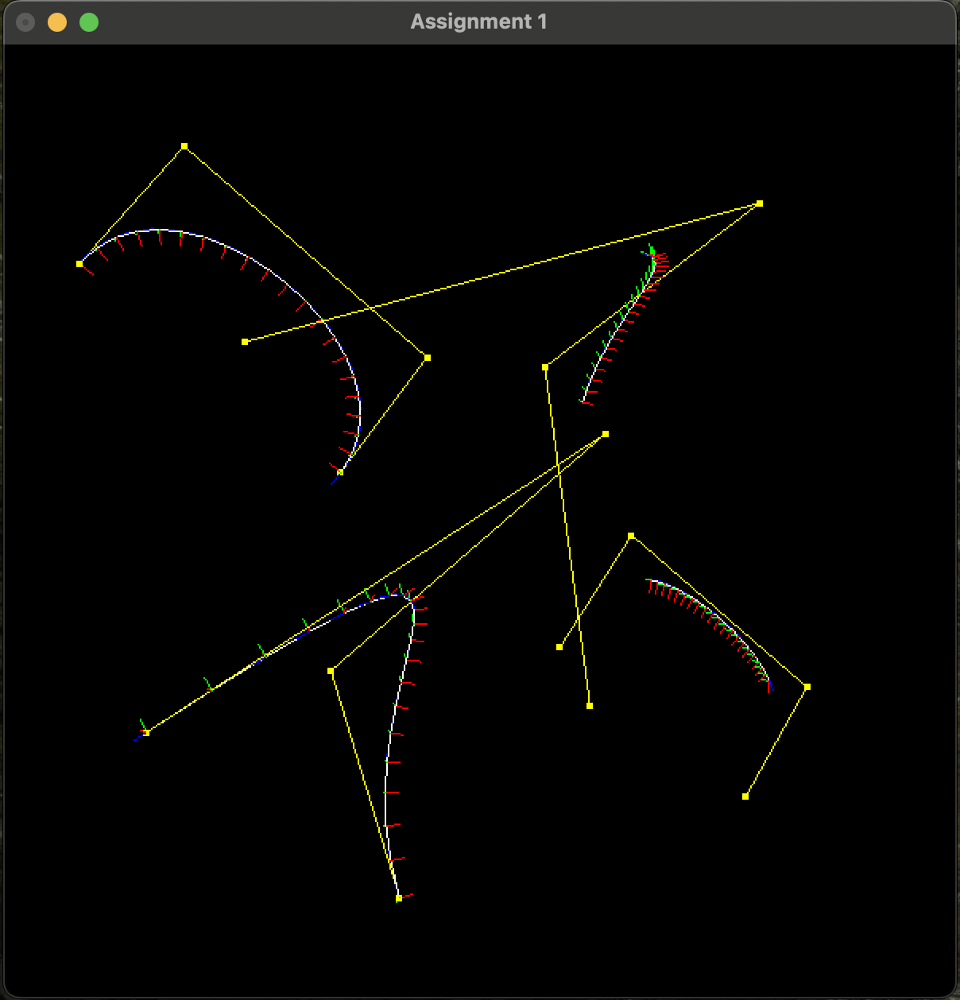
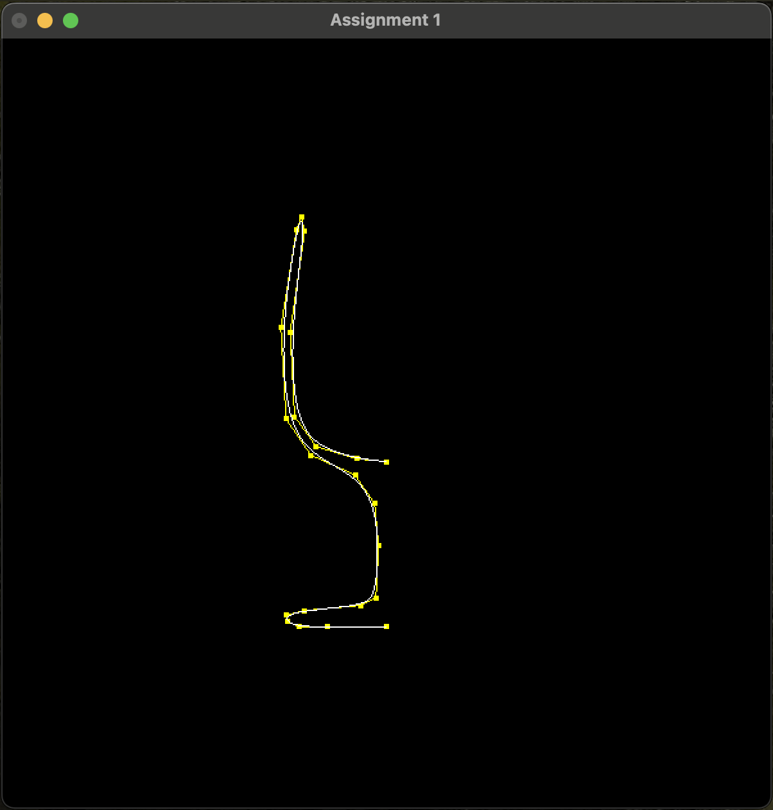
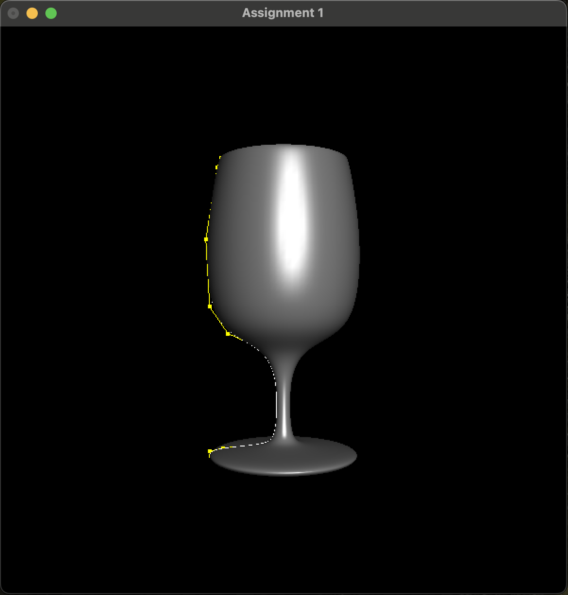
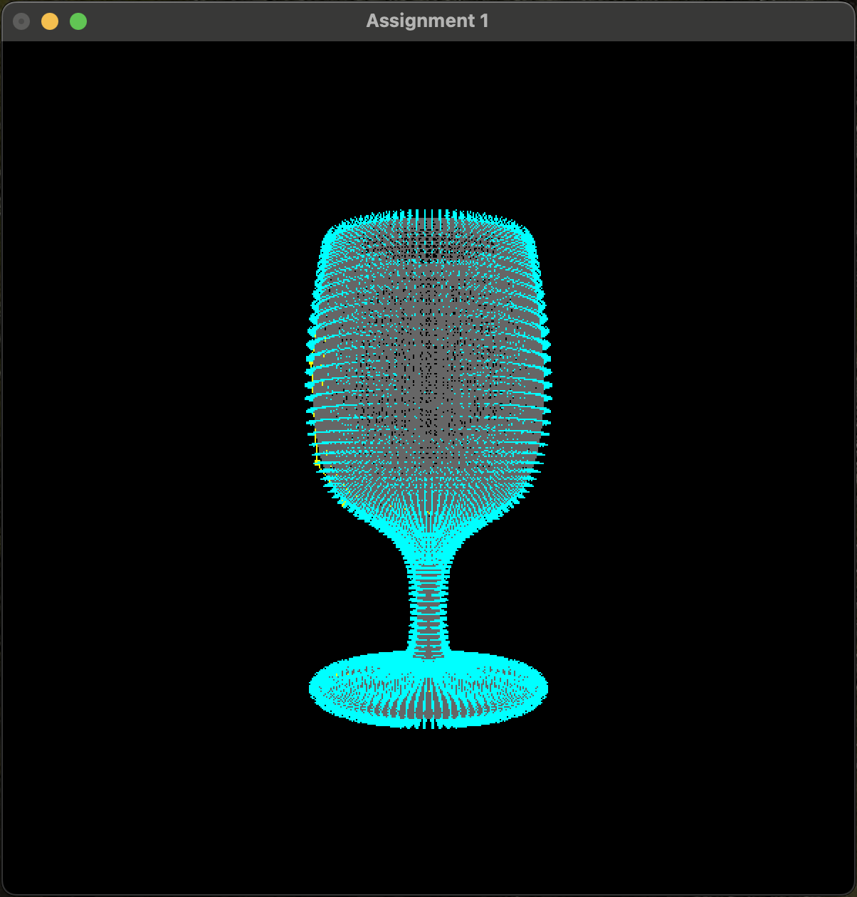
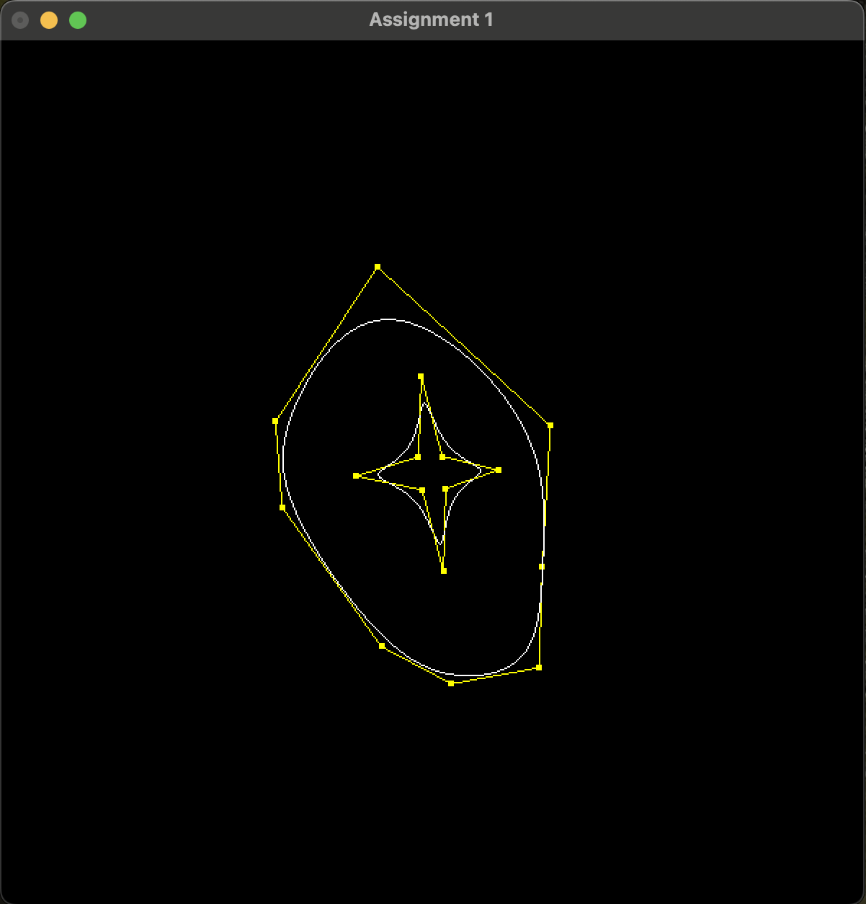
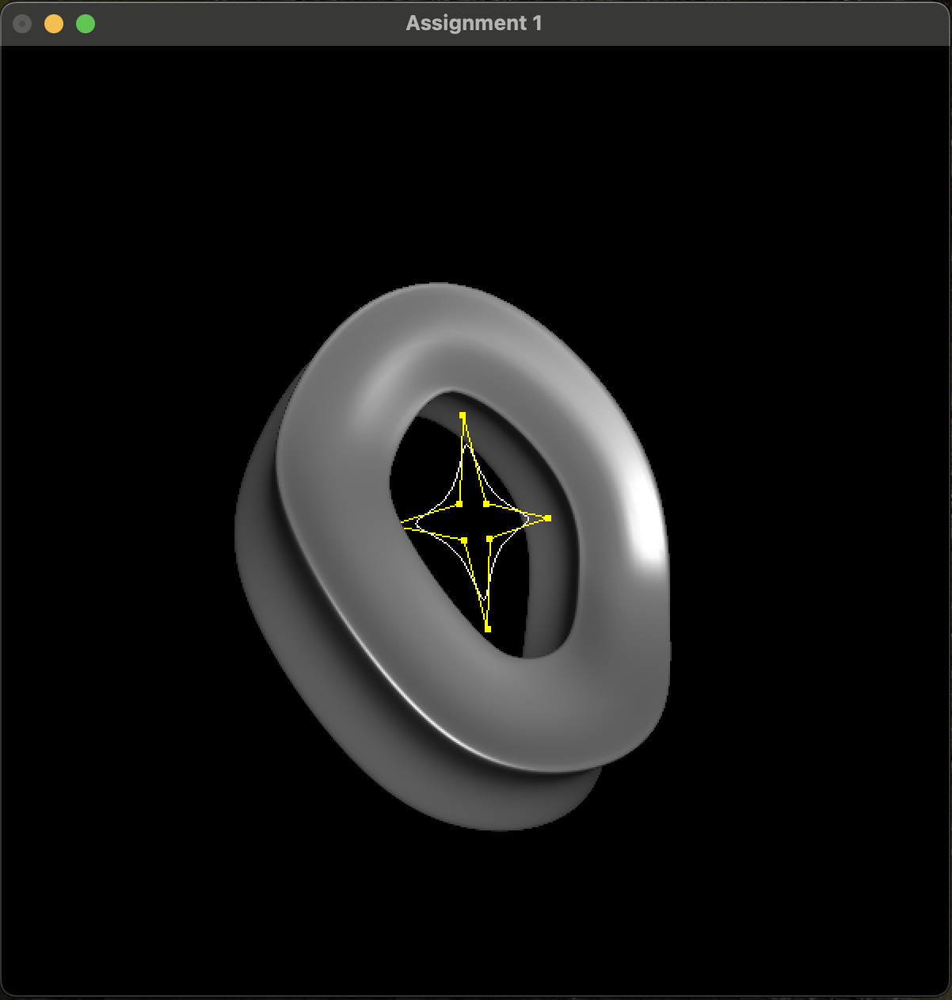
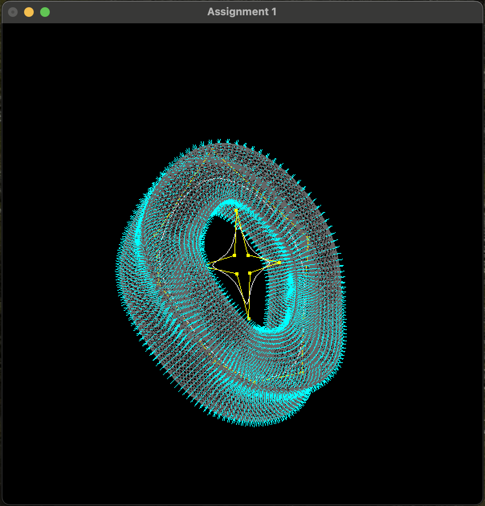

# MIT_6.837
My repository of assignments in a Computer Graphics course at MIT

I compiled on an M-series Mac using X-code 

### A1:

https://ocw.mit.edu/courses/6-837-computer-graphics-fall-2012/
